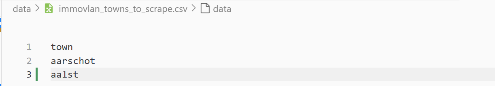
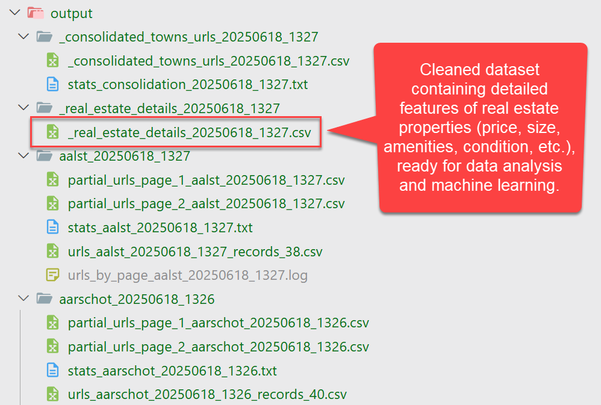
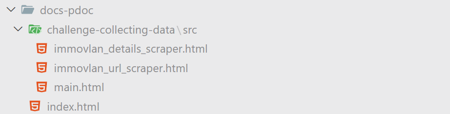

# challenge-collecting-data

This project demonstrates how to collect real estate data from **Immovlan** for multiple towns in Belgium using a **Selenium-based scraping pipeline**.  
The goal is to build a **clean dataset with over 10,000 property records**, which can later be used for **price prediction models**.


## Project Phases

1. **Collecting listing URLs per town**
2. **Consolidate the full list of real estate URLs from all towns**
3. **Extracting property details from those URLs**

The code supports:

- Pagination
- Headless scraping
- Anti-tracking filtering
- Data consolidation
- Resilience to session loss and cookie banners


## Prerequisites

Make sure **Python 3.12.10** is installed.

- [Download Python 3.12.10](https://www.python.org/downloads/release/python-31210/)
- Add Python to your system `PATH`

> ⚠️ This project is validated under Python 3.12.10. Other versions may result in compatibility issues.


## Environment Setup

Use the virtual environment to manage dependencies cleanly:

```bash
chmod +x setup-env.sh
./setup-env.sh
```

## Configuration of the scraper

From the file ```data/immovlan_towns_to_scrape_all_towns.csv```, select the towns you want to scrape.
Copy those towns to the file ```data/immovlan_towns_  to_scrape.csv```.  

See example below:


  

## Testing the Scraper
You can test the scraper on a single town by editing the `data/immovlan_towns_to_scrape.csv` file to include only one town.

In the `main.py` file, for the `ImmovlanUrlScraper` class, you can control the number of pages to scrape per town using the `max_pages` parameter. 
Set `max_pages = -1` for no page limit.

```python
scraper =  ImmovlanUrlScraper(base_url=url, town=town, headless=True, max_pages=2)
```

Similarly, the `ImmovlanDetailsScraper` class allows you to limit the number of real estate URL  to process by using the `limit` parameter.
Set `limit` = -1 to disable the limit.

```python
scraper_detail = ImmovlanDetailsScraper(output_dir="output", headless=True, limit=10)
```

## Running the Scraper

```bash
chmod +x run-main.sh
./run-main.sh
```
This will execute the main() function, which performs the following steps sequentially:
- Load towns from ```data/immovlan_towns_to_scrape.csv```
- Scrape listing URLs for each specified town
- Consolidate all URLs into a single dataset (without duplicates)
- Extract detailed information from each individual real estate listing (using Selenium + BeautifulSoup)
- Export all results as structured .csv files for further data analysis or ML training
- Logs, raw listings, consolidated URLs, and enriched property details are all stored in the ```output/``` folder.

## Output Structure

The ```output/``` folder contains all results produced by the scraping pipeline. The structure is automatically organized by town and by phase, with time-based timestamps for reproducibility.


### `_consolidated_towns_urls_YYYYMMDD_HHMM`

**Purpose**: Stores the full list of property listing URLs consolidated from all towns.

**Contains**:
- `_consolidated_towns_urls_20250618_1327.csv`: the cleaned and deduplicated dataset of all listing URLs.
- `stats_consolidation_20250618_1327.txt`: summary with number of files processed and total listings.


### `_real_estate_details_YYYYMMDD_HHMM`

**Purpose**: Stores enriched property data after visiting each individual listing URL.

**Contains**:
- `_real_estate_details_20250618_1327.csv`: the full dataset of scraped features (price, surface, kitchen, etc.).
> 👉 This is the **final output** of the project, intended to serve as the input dataset for **data analytics** and **machine learning models** (e.g. property price prediction).


### `town_YYYYMMDD_HHMM` (e.g., `aalst_20250618_1327`)

**Purpose**: Stores results for a single town.

**Contains**:
- `partial_urls_page_X_<town>_<timestamp>.csv`: raw URLs found on each page (for traceability).
- `urls_<town>_<timestamp>_records_<n>.csv`: final URL list after deduplication.
- `stats_<town>_<timestamp>.txt`: summary of the run (page count, URL count, etc.).
- `urls_by_page_<town>_<timestamp>.log`: log file with real-time scraping steps and issues.

Detailed example of the ```output/``` folder structure after running the scraper:


  


## Technologies Used

| Tool / Library           | Purpose                                                             |
|--------------------------|---------------------------------------------------------------------|
| `Python 3.12.10`         | Core programming language                                           |
| `Selenium + Selenium Wire` | Headless browser automation & network interception               |
| `BeautifulSoup4`         | HTML parsing and data extraction                                   |
| `pandas`                 | Structured data manipulation and CSV export                        |
| `json`                   | Handling API/XHR responses and JSON content                        |
| `logging`                | Structured logs with timestamps for debugging and reproducibility  |
| `bash scripts`           | Automated setup, execution, and documentation generation           |


## Dataset Structure (Target Schema)

Each row in the final CSV contains detailed real estate information extracted from Immovlan:

| Field Name               | Description |
|--------------------------|-------------|
| `town`                  | Name of the town where the property is located |
| `page`                  | Page number on which the URL was found |
| `url`                   | URL of the real estate listing |
| `property_type`         | Type of property (e.g., House, Apartment) |
| `price`                 | Advertised price (as text) |
| `address`               | Street address from the listing |
| `city`                  | Reserved for future use (currently None) |
| `bedrooms`              | Number of bedrooms |
| `bedroom1_surface`      | Surface area of bedroom 1 (in m<sup>2</sup>) |
| `bedroom2_surface`      | Surface area of bedroom 2 (in m<sup>2</sup>) |
| `bathrooms`             | Number of bathrooms |
| `toilets`               | Number of toilets |
| `surface_livable`       | Livable surface (in m<sup>2</sup>) |
| `terrace`               | Presence of terrace (Yes/No or 0/1) |
| `terrace_surface`       | Surface of the terrace (in m<sup>2</sup>) |
| `terrace_orientation`   | Orientation of the terrace (e.g., South, East) |
| `floor`                 | Floor number (if apartment) |
| `year_built`            | Year of construction |
| `condition`             | State of the building (e.g., Good, Renovation needed) |
| `kitchen_equipment`     | Level/type of kitchen equipment |
| `cellar`                | Presence of a cellar (Yes/No or 0/1) |
| `glazing_type`          | Type of glazing (e.g., Double, Triple) |
| `elevator`              | Elevator presence (Yes/No or 0/1) |
| `entry_phone`           | Presence of entry phone/intercom |
| `epc_score`             | Specific primary energy consumption (kWh/m<sup>2</sup>/year) |
| `epc_total`             | Yearly total energy consumption (kWh/year) |
| `epc_valid_until`       | Validity date of the EPC/PEB certificate |

> **Note**: Some fields are left as free text (e.g., orientation, equipment) and may require additional cleaning depending on downstream ML use cases.


## Optional: Generate Documentation

You can generate full documentation of the class methods using `pdoc`.

```bash
chmod +x run-doc-generation.sh
./run-doc-generation.sh
```
  


## Conclusion

This project demonstrates a robust and scalable way to extract structured real estate data from Immovlan using modern scraping techniques.  
It enables the creation of high-quality datasets tailored for **exploratory data analysis**, **machine learning models**, and **real estate market insights** in Belgium.

With its modular structure, cookie resilience, and extensibility, the pipeline can be reused or expanded for other platforms or data domains with minimal changes.


---

**Author**  
Linkedin: [Yves Schillings](https://www.linkedin.com/in/yschillings)  
Web site: [https://secloudis.com](https://secloudis.com) — Strategy, Data & AI Insights  


